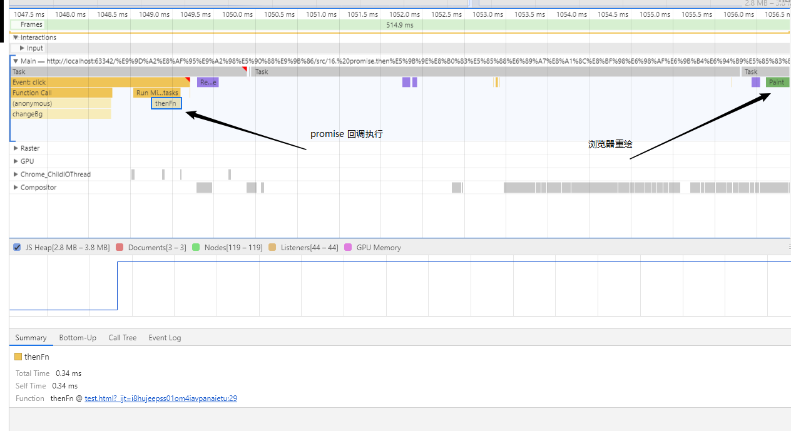
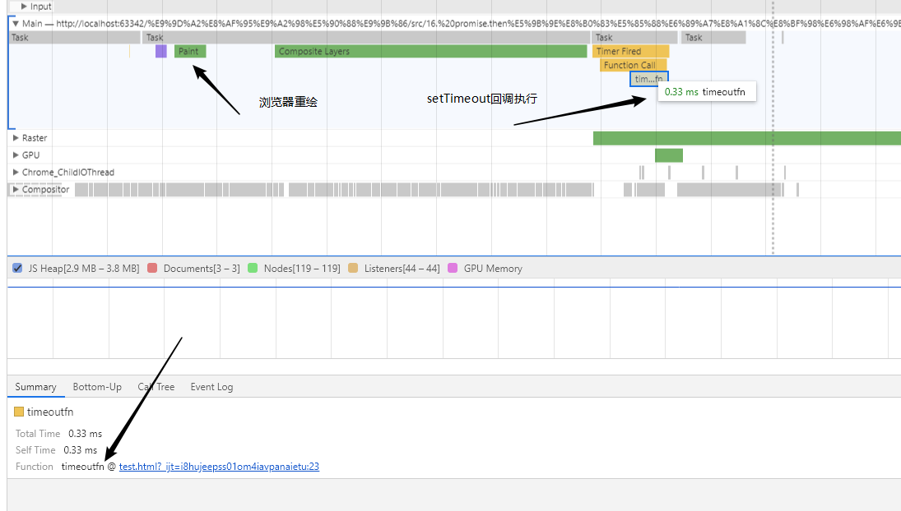

## 代码执行顺序？

```html
<style>
  #app {
    background-color: red;
    border: 1px solid #000;
    height: 20vh;
  }
</style>

<body>
  <div id="app">app</div>

  <button onclick="changeBg()">更改 app 的颜色</button>

  <script>
    function changeBg() {
      const app = document.querySelector("#app");

      setTimeout(function timeoutfn() {
        console.log("setTimeout");
      }, 0);

      app.style.backgroundColor = "#000";

      Promise.resolve().then(function thenFn() {
        console.log("promise ");
      });

      const target = performance.now() + 500;
      while (target > performance.now()) {}
    }
  </script>
</body>
```

## 问题

1. 过了多久才有`log`打印？
2. 先打印什么？后打印什么？
3. 先打印还是背景色先更改？

## 分析

我们知道

> `JS`会阻塞页面加载

从上述的互斥关系，可以推导出，`JS` 如果执行时间过长就会阻塞页面。
譬如，假设 `JS` 引擎正在进行巨量的计算，此时就算 `GUI` 有更新，也会被保存到队列中，等待 `JS` 引擎空闲后执行。

## Chrome devtools

打开`Chrome devtools`切换到`performance`，记录下快照，查看执行顺序。

- 
- 

## 回答问题

1. 过了`500ms`开始有打印。
2. 先打印`promise`，再更改背景色，再打印`setTimeout`。
