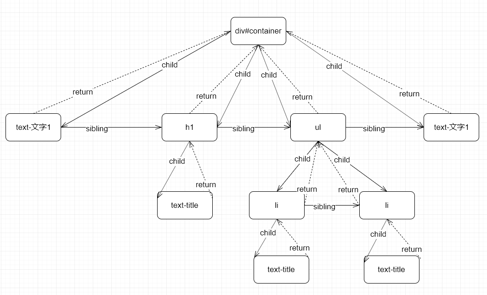

## fiberNode 的数据结构

在`react`的源码中`Fiber`定义了一大堆东西，在这里是进行简化的，主要涉及到 `return child sibling`等等。

### 例子

假设我们有以下一个组件

```jsx harmony
/** @jsx h */
const App = (
  <div id="container">
    文字1
    <h1>title</h1>
    <ul>
      <li>li-1</li>
      <li>li-2</li>
    </ul>
    文字2
  </div>
);
```

借助`tsc`编译成`h`函数调用形式得到以下代码

```typescript
const res = h(
  "div",
  { id: "container" },
  "文字1",
  h("h1", null, "title"),
  h("ul", null, h("li", null, "li-1"), h("li", null, "li-2")),
  "文字2"
);
```

对应的`FiberNode`结构如图


那我们实现以下`h`函数来生成对应的数据结构

```typescript
type Props = {
  [key: string]: any;
};

class FiberNode {
  return: FiberNode | null = null;
  child: FiberNode | null = null;
  sibling: FiberNode | null = null;

  constructor(public tag: string, public props: Props = {}) {}
}

function createFiberNode(type: string, props: Props) {
  return new FiberNode(type, props);
}

function createTextFiberNode(value: string) {
  return new FiberNode("text", { children: value });
}

function h(type: string, props: Props | null, ...children: any[]): FiberNode {
  let fiberNode = createFiberNode(type, props || {});

  children.forEach((child: string | FiberNode, i: number) => {
    if (typeof child === "string") {
      child = createTextFiberNode(child);
      children[i] = child;
    }

    if (!fiberNode.child) {
      fiberNode.child = child;
    }
    let sibling = children[i + 1];
    if (sibling) {
      if (typeof sibling === "string") {
        sibling = createTextFiberNode(sibling);
        children[i + 1] = sibling;
      }
      child.sibling = sibling as FiberNode;
    }

    child.return = fiberNode;
  });

  return fiberNode;
}
```
