## 记一次 vue 项目优化

### 前言

有个朋友让帮忙看一下他的平台怎么点着点着就如图所示

### 分析

造成界面 crash 的原因一般有：

- 内存方面

  - 内存泄漏
  - 频繁的垃圾回收

- cpu 方面

  - 死循环或者递归函数没有按预期结束调用

#### 第一步，从内存开始分析

当我登录进去系统点了好一会之后我感觉到有卡了，此时我看了一眼内存。

妥了，这稳稳的内存泄漏了。

- ##### destroy g2 chart

  系统里面挺多图表的，猜测应该是在`VueComponent destroy`的时候没有`destroy`图表，翻了一眼代码，果然如此。

  另外，通过对比`memory`标签提供的快照也可以发现

  1. 
  2. 
  3. 

- #### 触发频繁的垃圾回收

  - 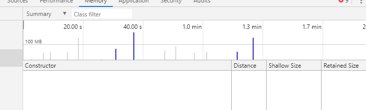
  - 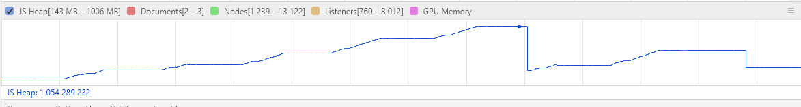
  - 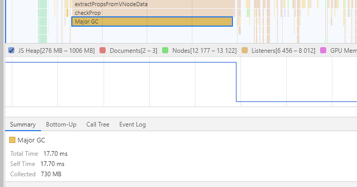
  - 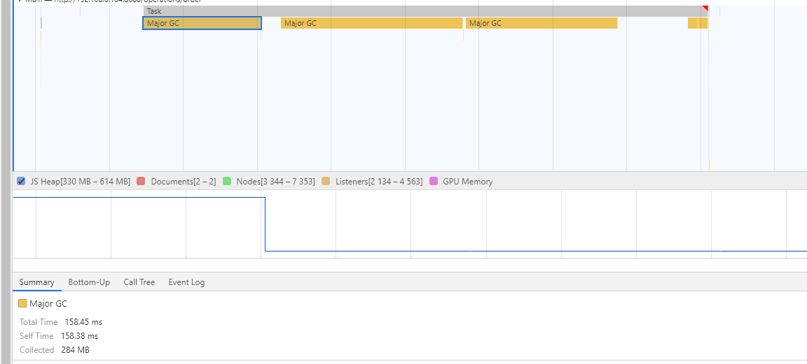
    通过观察系统使用时的内存记录来看(只使用了 28S)，每点击一个路由就会申请大量的内存，离开之后，不管是手动触发垃圾回收，还是等浏览器自己进行垃圾回收，内存都会降下来。

  记录内存快照，发现其中很多数据内容一样，但是内存地址不同，同时也发现变量的名字都是一样的`menuButtonType`，在代码里搜了一下，发现注册了全局的`mixins`，里面除了这个数组还有其他的好多方法，以及其他数组对象等等。

  - 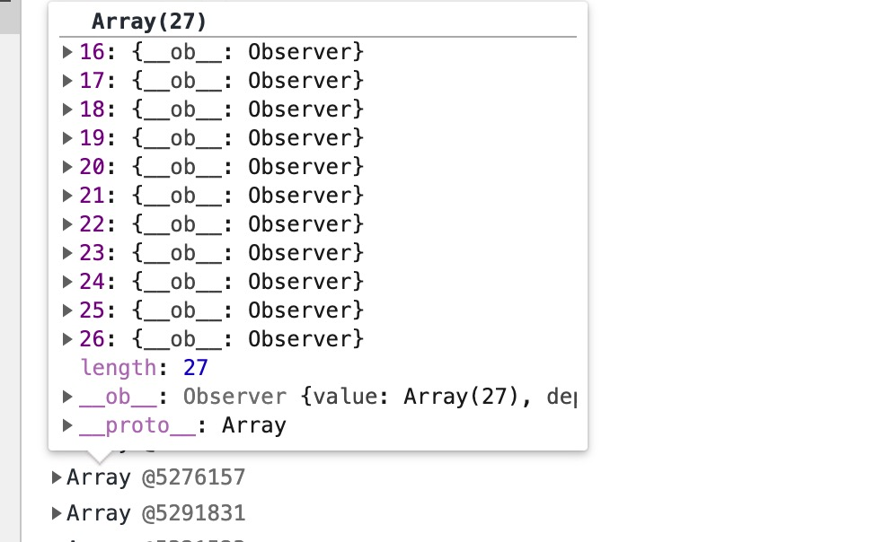
  - 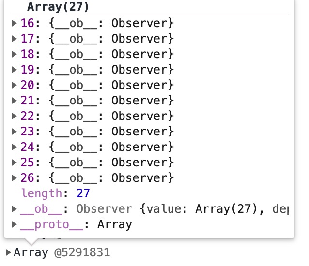
  - 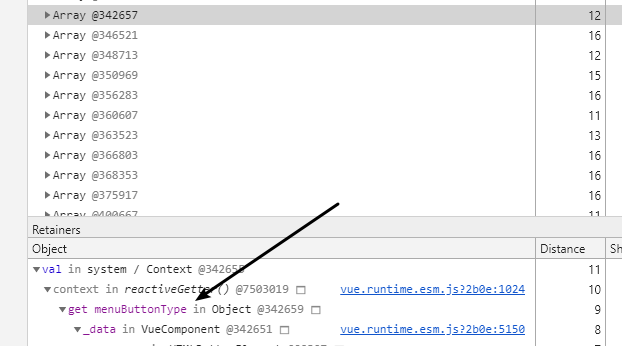

  将全局的`mixins`修改成直接挂载到`vue.prototype`之后(当然这并不是个好方法，我个人不喜欢)，对比前后内存。

  - 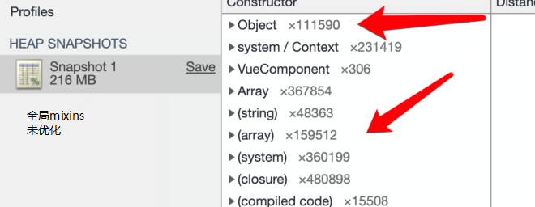
  - 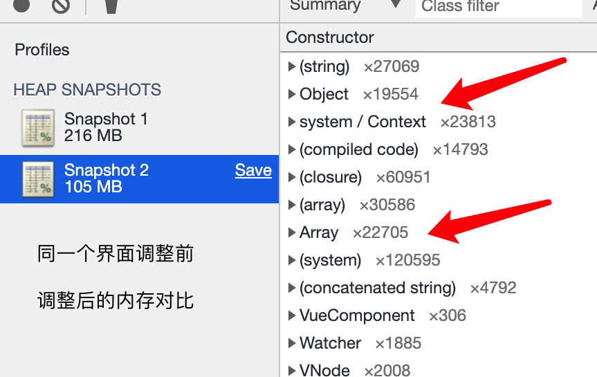

  从上面的图看出来同一个界面将近优化了一半内存，`VueComponent`越多优化也越多。

  在查看修改后的一段时间的内存记录，最高峰的内存也才 120 多，未优化时候的记录是`600-1024`。

* 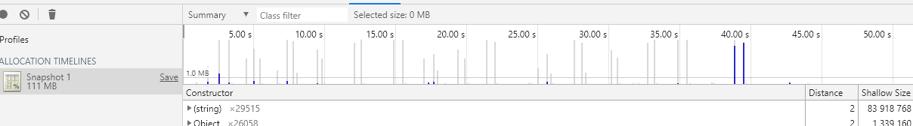
* 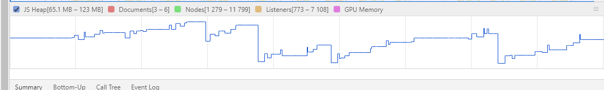

### 总结

- 引用的第三方插件之类的，记得要在`vue destroy`的时候把插件也`destroy`
- 全局`mixins`慎用
