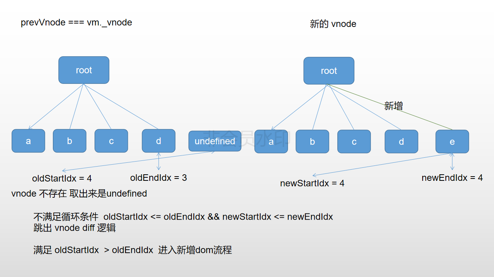

## vnode children diff push 流程

示例代码：

```html
<div id="app">
  <div v-for="item in list" :key="item">{{item}}</div>
</div>

<script type="module">
  import Vue from "../../dist/vue.esm.browser.js";

  window.vm = new Vue({
    el: "#app",
    data() {
      return {
        list: ["a", "b", "c", "d"]
      };
    },
    methods: {
      push() {
        this.list.push("e");
      }
    }
  });
</script>
```

1. 
1. 
1. 
1. 
